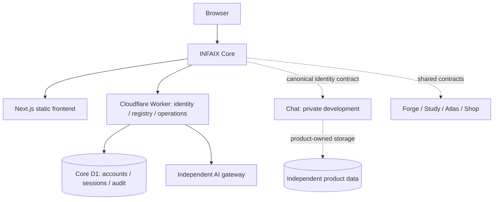

<p align="center"></p>

# INFAIX

**Build what's next.** A connected technology ecosystem: independent products, one INFAIX identity, joined through INFAIX Core.

## About INFAIX

INFAIX builds and explores software, AI, hardware, robotics and infrastructure. Core is the ecosystem's public entry point and canonical identity layer. Products can evolve and deploy independently while sharing an INFAIX account and a consistent visual language.

## Ecosystem

| Application | Lifecycle | Availability |
|---|---|---|
| Core | Live | Public website and invite-based accounts |
| Forge | Live | Public infrastructure and project showcase |
| AI | Live interface | Sign-in and AI entitlement required; gateway configuration determines runtime availability |
| Chat | Private development | Not publicly launched |
| Study | Planned | Unavailable |
| Atlas | Planned | Unavailable |
| Shop | Planned | Unavailable |

The [typed registry](src/lib/app-registry.ts) is the source of truth for discovery. Lifecycle labels are configuration, not uptime guarantees. Planned applications have no launch links. Chat is excluded from public navigation and the public registry response.

## Architecture



Dashed connections describe the integration direction, not a claim that all products or shared services are implemented. Forge currently has a public showcase inside Core; independently deployed product frontends are not forced into this repository.

## INFAIX Core

- Public homepage, ecosystem discovery and accessible application switching.
- Invite-based canonical accounts, verification, sessions and password recovery.
- Server-enforced OWNER, ADMIN and USER roles.
- `/admin` Operations Console with D1-backed identity/audit aggregates.
- Owner-only user listing and AI entitlement management.
- Same-origin AI bridge to an independently operated gateway.

The frontend is a **static export**. Protected data and actions live in the Worker, not in Next.js Server Actions or a client route guard.

## Technology

Next.js 16.3.4 (App Router), React 19, TypeScript, Tailwind CSS 4 and custom CSS; Cloudflare Workers, Static Assets and D1; Web Crypto and `jose`; Vitest and ESLint. Typography uses Space Grotesk and Inter. The existing canvas geometry, cosmic layers and INFAIX artwork remain part of the identity.

## Repository Structure

| Path | Purpose |
|---|---|
| `src/app/` | Static pages, account flows, operations UI and global styles |
| `src/components/` | Navigation, launcher, logo, ambient background and shared presentation |
| `src/lib/` | Registry, serializable contracts, API client and redirect validation |
| `worker/` | Asset delivery, API routing, identity, monitoring and AI bridge |
| `db/migrations/` | Ordered D1 schema migrations |
| `tests/` | Authorization, identity, registry, telemetry and storage tests |
| `scripts/` | Operator account/invitation helpers |
| `docs/` | Design, identity, integration and operations documentation |

## Development

Use Node.js 24 and npm. The SQL integration tests use the built-in Node SQLite module.

```sh
npm ci
npm run dev
```

The frontend runs at `http://localhost:3000`. Next development mode has no Worker API; account and operations requests will be unavailable. Read the installed Next.js guides in `node_modules/next/dist/docs/` before changing framework code.

For full-stack local development, first create an ignored `.dev.vars` file with development-only Worker configuration, including `ENVIRONMENT` set to `development` and a locally generated `SESSION_SECRET`. This overrides production configuration during local development. Never copy production secrets into local fixtures.

```sh
npm run build
npx wrangler d1 execute infaix-db --local --file=db/migrations/0001_init.sql
npx wrangler d1 execute infaix-db --local --file=db/migrations/0002_ai_access.sql
npx wrangler d1 execute infaix-db --local --file=db/migrations/0003_conversations.sql
npx wrangler dev --local
```

Apply migrations to a fresh local store, or only apply those not already applied. The second and third migrations are not a general-purpose repeatable reset procedure. `out/` contains the static site. Rebuild after frontend changes. `next start` is not the serving path for this static-export deployment. Account bootstrap and invitation procedures are documented in [authentication](docs/authentication.md) and [auth](docs/auth.md).

## Environment

Worker runtime configuration belongs in local `.dev.vars` or Cloudflare configuration/secrets, not browser-visible `NEXT_PUBLIC_*` variables. This list documents **names only**.

| Names | Purpose |
|---|---|
| `INFAIX_DB`, `ASSETS` | D1 and static asset bindings |
| `SESSION_SECRET`, `ENVIRONMENT` | Session signing and runtime environment |
| `EMAIL_PROVIDER`, `EMAIL_FROM`, `RESEND_API_KEY` | Production transactional email |
| `APP_ORIGIN`, `COOKIE_DOMAIN`, `CORS_EXTRA_ORIGINS` | Identity origin, cookie scope and approved origins |
| `PBKDF2_ITERATIONS` | Password hashing cost |
| `ADMIN_BOOTSTRAP_TOKEN` | Temporary operator bootstrap; not accepted by operations or owner-only user endpoints |
| `AI_GATEWAY_URL`, `AI_GATEWAY_SECRET`, `AI_GATEWAY_SECRET_PREVIOUS`, `AI_GATEWAY_AUDIENCE` | Server-to-server AI bridge |
| `AI_CHAT_USER_LIMIT`, `AI_CHAT_USER_WINDOW`, `AI_CHAT_IP_LIMIT`, `AI_CHAT_IP_WINDOW`, `AI_UPSTREAM_TIMEOUT_MS` | AI budgets and timeout |
| `CHAT_ORIGIN`, `CHAT_IDENTITY_PRIVATE_KEY`, `CHAT_IDENTITY_AUDIENCE` | Existing private Chat identity handoff; not a public launch switch |
| `RL_LOGIN_LIMIT`, `RL_LOGIN_WINDOW`, `RL_REGISTER_LIMIT`, `RL_REGISTER_WINDOW` | Login/registration rate limits |
| `RL_RESET_LIMIT`, `RL_RESET_WINDOW`, `RL_VERIFY_LIMIT`, `RL_VERIFY_WINDOW`, `RL_ADMIN_LIMIT`, `RL_ADMIN_WINDOW` | Recovery, verification and administration limits |

See [`.env.example`](.env.example) for configuration explanations. Do not commit actual secret values, identity signing keys or local account data.

## Testing

```sh
npm test
npx tsc --noEmit
npm run lint
npm run build
npx wrangler deploy --dry-run
git diff --check
```

Tests cover registry release gates, role restrictions, monitoring authorization/redaction, request metadata, and existing identity/AI behavior. Browser review checks the preserved visual identity, launcher keyboard flow and responsive layout. No telemetry fixture is used in production UI.

## Deployment

Next builds static assets into `out/`; Wrangler bundles `worker/index.ts` and attaches Static Assets and D1 according to `wrangler.jsonc`. Worker-first routing handles `/api/*` and static export aliases. Cloudflare Workers Logs are already enabled by configuration. No repository CI pipeline is currently defined.

Deployment is a separate operator action after quality gates and configuration review. Database migration, DNS, account administration and secret management are separate operations; builds and dry runs do not perform them.

## Security

Identity and authorization are verified server-side for each protected API request. The Operations Console admits ADMIN and OWNER sessions; existing user/AI access management remains OWNER-only. Private visibility is a discovery rule, never an access-control substitute. Monitoring returns aggregate counts and allowlisted event names, never tokens, passwords, session IDs, IP addresses, prompts or message bodies.

See [SECURITY.md](SECURITY.md), [identity documentation](docs/authentication.md) and [operations contract](docs/core-operations.md).

## Status

Core is evolving from the existing website into a shared platform. Accounts and the AI bridge are implemented. Chat remains private development; Study, Atlas and Shop are planned. Runtime probes, deployment ingestion, historical request analytics, AI cost/token metrics and shared-service expansion are not implemented. Missing measurements are shown as unavailable rather than invented.

Integration guidance: [INFAIX application contract](docs/core-integration.md). Visual preservation audit: [Core design audit](docs/core-design-audit.md).

## License

INFAIX. All rights reserved.
